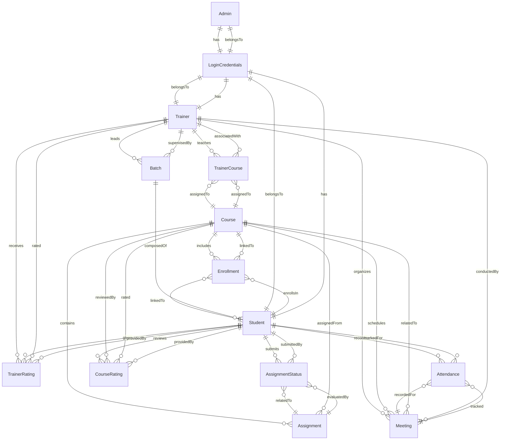

```mermaid
erDiagram
    Admin ||--|| LoginCredentials : has
    Trainer ||--o{ TrainerCourse : teaches
    Trainer ||--o{ Meeting : organizes
    Trainer ||--o{ TrainerRating : receives
    Trainer ||--o{ Batch : leads
    Trainer ||--|| LoginCredentials : has
    Student ||--o{ Enrollment : enrollsIn
    Student ||--o{ Attendance : records
    Student ||--o{ TrainerRating : gives
    Student ||--o{ CourseRating : reviews
    Student ||--o{ AssignmentStatus : submits
    Student ||--|| LoginCredentials : has
    Course ||--o{ Enrollment : includes
    Course ||--o{ TrainerCourse : assignedTo
    Course ||--o{ CourseRating : reviewedBy
    Course ||--o{ Assignment : contains
    Course ||--o{ Meeting : schedules
    Enrollment }o--|| Student : linkedTo
    Enrollment }o--|| Course : linkedTo
    TrainerCourse }o--|| Trainer : associatedWith
    TrainerCourse }o--|| Course : assignedTo
    Meeting }o--|| Course : relatedTo
    Meeting }o--|| Trainer : conductedBy
    Meeting ||--o{ Attendance : tracked
    Attendance }o--|| Student : markedFor
    Attendance }o--|| Meeting : recordedFor
    Assignment }o--|| Course : assignedFrom
    Assignment ||--o{ AssignmentStatus : evaluatedBy
    AssignmentStatus }o--|| Assignment : relatedTo
    AssignmentStatus }o--|| Student : submittedBy
    Batch }o--|| Trainer : supervisedBy
    Batch ||--o{ Student : composedOf
    TrainerRating }o--|| Trainer : rated
    TrainerRating }o--|| Student : providedBy
    CourseRating }o--|| Course : rated
    CourseRating }o--|| Student : providedBy
    LoginCredentials ||--|| Admin : belongsTo
    LoginCredentials ||--|| Trainer : belongsTo
    LoginCredentials ||--|| Student : belongsTo
```

